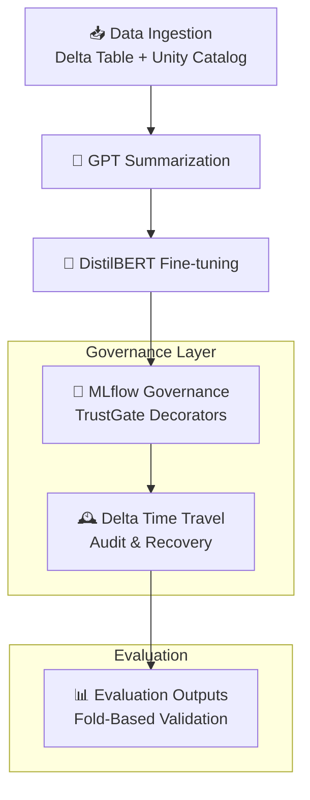

# 🏢 Compliance AI Reference Architecture

This repository demonstrates **enterprise-ready compliance patterns** for deploying AI systems in regulated industries (healthcare, finance, insurance).  
It bridges **technical engineering** with **legal, privacy, and audit requirements**, showing how to move from **prototype → production-grade AI**.

---

## 📂 Repository Structure

- **`notebooks/`**  
  Databricks notebooks implementing the full governed AI pipeline.  
  Includes:  
  - 🧠 `01_ingest_transcribe_delta.py` – Ingests and stages audio transcripts into Delta tables with ACID guarantees.  
  - 🔍 `02_governance_mlflow.py` – Registers, tracks, and audits DistilBERT model runs via MLflow + TrustGate decorators.  
  - 🕰 `03_delta_acid_timetravel.py` – Demonstrates rollback and versioning for reproducibility and compliance.  
  - 🖼️ `outputs/` – Screenshots and HTML exports showing cell outputs, visualizations, and evaluation metrics.  

- **`compliance_patterns/`**  
  Core **architecture-level patterns** ensuring privacy, auditability, and reproducibility.  
  Includes:  
  - 🔒 PHI/PII Masking  
  - 🧾 Audit & Traceability Decorators  
  - 📜 MLflow Model Governance  
  - 🕰 Delta Lake ACID + Time Travel  
  - 📑 Compliance Checklists  

- **`governance_templates/`**  
  **Templates and workflows** that make compliance repeatable and auditable.  
  Includes:  
  - 📜 Model Cards  
  - ✅ Compliance Checklists  
  - 🚦 Approval Gates  
  - 📊 Monitoring & Reporting  

- **`architecture/`**  
  Diagrams, narratives, and explanations of the Databricks workflow.  
  - `diagram.png` – End-to-end pipeline from ingestion to governance.  
  - `README.md` – Narrative overview and fold-strategy explanation (3-fold / 5-fold / 30-fold).  

---

## 🎯 Goals

1. **Shift Left on Governance**  
   Embed compliance directly into code, not as an afterthought.

2. **Enable Regulators & Boards**  
   Provide **clear audit trails, sign-offs, and reproducibility**.

3. **Standardize Trustworthy AI**  
   Deliver **patterns + templates** that can be reused across all AI projects.

---

## 🧠 Databricks Workflow Overview

```mermaid
flowchart TD
    A[📥 Data Ingestion<br/>Delta Table + Unity Catalog] --> B[🤖 GPT Summarization]
    B --> C[🧩 DistilBERT Fine-tuning]
    C --> D[📜 MLflow Governance<br/>TrustGate Decorators]
    D --> E[🕰 Delta Time Travel<br/>Audit & Recovery]
    E --> F[📊 Evaluation Outputs<br/>Fold-Based Validation]

    subgraph Governance Layer
        D
        E
    end

    subgraph Evaluation
        F
    end
```

This flow captures the **governed Databricks lifecycle**: ingestion → summarization → model training → MLflow logging → version rollback.  
Every run is traceable and reproducible under enterprise-grade audit controls.

---

## 🏆 Why This Matters

Regulated industries face the dual challenge of **innovation + oversight**.  
This repository shows how to make AI **trustworthy, auditable, and board-ready**, ensuring adoption doesn’t stall at *“proof of concept.”*  

By using these patterns:  
- Engineers get **clear compliance scaffolding**.  
- Risk/Legal teams see **auditability & controls**.  
- Executives gain **confidence to scale AI safely**.

---

## 🧩 Key Compliance Features

| Feature | Description |
|----------|-------------|
| **TrustGate Decorators** | Unified logging, retries, and correlation IDs applied to Databricks runs |
| **Delta ACID + Time Travel** | Reproducible version control and rollback for governed data |
| **MLflow Governance Layer** | Centralized model tracking with ownership and risk metadata |
| **Evaluation Fold Patterns** | Demonstrates 3-fold, 5-fold, and 30-fold stratified evaluations for reliability |
| **Policy Templates** | Governance artifacts ready for audit submission |

---

## 🚀 Next Steps

- Extend templates for **bias detection and explainability**.  
- Add **multi-region data residency** patterns for GDPR/HIPAA.  
- Integrate **Databricks jobs** with CI/CD pipelines using GitHub Actions.  
- Publish **compliance-ready APIs** with FastAPI unit tests.

---

> 💡 This repository is a **blueprint** for any team that needs to prove:  
> *“Our AI is compliant, auditable, and production-ready.”*
