# 🏢 Compliance AI Reference Architecture

This repository demonstrates **enterprise-ready compliance patterns** for deploying AI systems in regulated industries (healthcare, finance, insurance).  
It bridges **technical engineering** with **legal, privacy, and audit requirements**, showing how to move from **prototype** → **production-grade AI**.

---

## 📂 Repository Structure

- **`compliance_patterns/`**  
  Core **architecture-level patterns** that ensure privacy, auditability, and reproducibility.  
  Includes:  
  - 🔒 PHI/PII Masking  
  - 🧾 Audit & Traceability  
  - 📜 Model Governance via MLflow  
  - 🕰 Delta Lake ACID + Time Travel  
  - 📑 Compliance Checklists  

- **`governance_templates/`**  
  **Templates and workflows** that make compliance repeatable and auditable.  
  Includes:  
  - 📜 Model Cards  
  - ✅ Compliance Checklists  
  - 🚦 Approval Gates  
  - 📊 Monitoring & Reporting  

---

## 🎯 Goals

1. **Shift Left on Governance**  
   Embed compliance into the **design and code**, not as an afterthought.

2. **Enable Regulators & Boards**  
   Provide **clear audit trails, sign-offs, and reproducibility**.

3. **Standardize Trustworthy AI**  
   Deliver **patterns + templates** that can be reused across AI projects.

---

## 🛠️ Tech Stack

- **Databricks / Delta Lake** for secure, governed data pipelines.  
- **Unity Catalog** for fine-grained access + column-level masking.  
- **MLflow** for model governance and approval gates.  
- **Python / FastAPI** for API compliance enforcement hooks.  

---

## 📊 Architecture Overview

```mermaid
flowchart TD
    A[🔒 PHI/PII Masking<br/>Unity Catalog] --> B[🧾 Audit Logs<br/>Delta Lake]
    B --> C[📜 MLflow Model Governance]
    C --> D[🚦 Approval Gates<br/>Compliance Templates]
    D --> E[📊 Monitoring & Reporting<br/>Dashboards]

    subgraph Data Layer
        A
        B
    end

    subgraph Model Lifecycle
        C
        D
    end

    subgraph Oversight
        E
    end
```

This diagram shows how **compliance hooks** flow across the stack:  
data → models → approvals → monitoring.

---

## 🏆 Why This Matters

Regulated industries face the dual challenge of **innovation + oversight**.  
This repo shows how to make AI **trustworthy, auditable, and board-ready**, ensuring adoption doesn’t stall at *“proof of concept”*.  

By using these patterns:  
- Developers get **clear compliance scaffolding**.  
- Risk/Legal teams see **auditability & controls**.  
- Executives gain **confidence to scale AI safely**.

---

## 🚀 Next Steps

- Extend templates for **explainability & bias monitoring**.  
- Add **multi-region data residency patterns**.  
- Publish **sample compliance-ready APIs** with unit tests.

---

> 💡 This repository is a **blueprint** for any team that needs to prove:  
> *“Our AI is compliant, auditable, and production-ready.”*
