# 🏗️ Architecture Blueprints

This folder provides **high-level architecture views** that show how compliance and governance are embedded into AI systems.  
The diagrams and notes here are intended for **executives, regulators, and technical architects** to understand the **big picture**.

 
 
---

## 🖼️ Example: Compliance-Aware AI Pipeline

```mermaid
flowchart LR
    subgraph Ingestion
        A[📥 Audio Upload] --> B[🔒 PHI/PII Masking]
        B --> C[🧾 Append-only Audit Logs]
    end

    subgraph Storage
        C --> D[🗂️ Delta Lake<br/>ACID + Time Travel]
    end

    subgraph ModelOps
        D --> E[📜 MLflow Registry<br/>Model Metadata]
        E --> F[🚦 Approval Gates]
    end

    subgraph Monitoring
        F --> G[📊 Compliance Dashboards<br/>Bias, Latency, Drift]
    end

    G -->|Reports| H[📑 Regulators & Boards]
```

---

## 🎯 Purpose

The **Architecture folder** ensures that stakeholders can:  
- See how compliance is **built into every layer** (data, models, approvals, monitoring).  
- Use these diagrams for **audits, design reviews, and board updates**.  
- Extend with **custom views** (multi-region, cloud provider–specific, etc.).  

---

> 💡 Best Practice: Pair every diagram with a **short explainer markdown file** so non-technical readers understand why the control matters.
